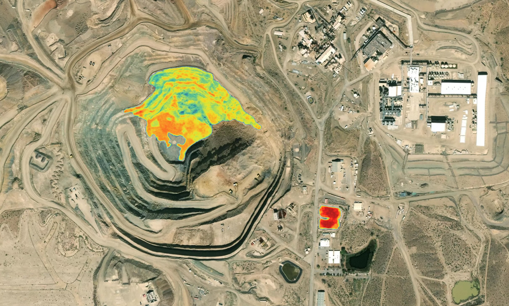

# Pixel Map Hover Tooltip System - Complete Documentation

## Overview

The Pixel Map system is an interactive visualization tool that displays real-time scientific data (mineral concentrations, temperatures, emissions, etc.) when users hover over satellite/imagery images. The data is encoded into separate image files using RGB channels, and JavaScript dynamically extracts and displays this information in tooltips.

---

## Architecture Overview

### Core Components

1. **Data Storage**: Configuration object (`PIXEL_MAP_DATA`) containing all metric definitions
2. **Texture Images**: Hidden PNG images where data is encoded in RGB channels
3. **Visible Image**: The displayed image users interact with
4. **Canvas Element**: Used to read pixel data from texture images
5. **Tooltip Element**: Dynamically populated overlay showing statistics

---

## How It Works - Step by Step

### Step 1: Data Encoding

Data is stored in a large JavaScript object (`PIXEL_MAP_DATA`) organized by section ID:

```javascript
const PIXEL_MAP_DATA = {
    "mining": {
        keyMap: {
            "Bastnasite wt%": {
                channel: 0,        // Red channel
                texture: "bastnasite-2422x1458_tex0",
                min: 0,
                max: 12.4
            },
            "Barite wt%": {
                channel: 1,        // Green channel
                texture: "bastnasite-2422x1458_tex0",
                min: 0,
                max: 40
            }
        },
        textures: {
            "bastnasite-2422x1458_tex0.png": "https://..."
        }
    }
}
```

**Key Concepts:**
- Each metric uses one RGB channel (Red=0, Green=1, Blue=2)
- One texture image can store 3 metrics (one per channel)
- Multiple texture images allow storing many metrics
- Each metric has min/max values for conversion
- Some metrics use categorical values (uniqueValues array)

### Step 2: Initialization

When the page loads:

1. JavaScript finds all `.pixel-map` elements
2. For each element, creates a `PixelMap` instance
3. Looks up the element's `id` in `PIXEL_MAP_DATA`
4. Loads all texture images referenced for that section
5. Sets up event listeners on the visible image

```javascript
// Initialization flow
document.querySelectorAll('.pixel-map').forEach(element => {
    const sectionId = element.id;  // e.g., "mining"
    const data = PIXEL_MAP_DATA[sectionId];
    new PixelMap(element);  // Uses data to initialize
});
```

### Step 3: Mouse Hover Detection

When user moves mouse over the image:

**A. Coordinate Conversion**

The system converts screen coordinates to actual image pixel coordinates:

```
Screen Coordinates (what you see)
    ↓
Mouse position: (clientX, clientY)
    ↓
Image bounding rect calculations
    ↓
Account for image scaling/letterboxing
    ↓
Image Pixel Coordinates (x, y)
```

**B. Why Coordinate Conversion is Needed**

- Images are often scaled/stretched to fit containers
- Browser may add letterboxing (black bars) to maintain aspect ratio
- Must convert from displayed size to actual image dimensions
- Handles two cases:
  - **Wide images**: Letterboxed on top/bottom
  - **Tall images**: Letterboxed on left/right

**C. The Conversion Algorithm**

```javascript
// Get dimensions
const rect = image.getBoundingClientRect();
const displayedWidth = rect.width;
const displayedHeight = rect.height;
const naturalWidth = image.naturalWidth;  // Actual image size
const naturalHeight = image.naturalHeight;

// Calculate aspect ratios
const imageAspect = naturalWidth / naturalHeight;
const displayedAspect = displayedWidth / displayedHeight;

if (imageAspect > displayedAspect) {
    // Image is wider - letterboxed vertically
    const scaledWidth = naturalWidth * (displayedHeight / naturalHeight);
    const offsetX = (scaledWidth - displayedWidth) / 2;
    
    imageX = Math.floor(((mouseX - rect.left + offsetX) / scaledWidth) * naturalWidth);
    imageY = Math.floor(((mouseY - rect.top) / displayedHeight) * naturalHeight);
} else {
    // Image is taller - letterboxed horizontally
    const scaledHeight = naturalHeight * (displayedWidth / naturalWidth);
    const offsetY = (scaledHeight - displayedHeight) / 2;
    
    imageX = Math.floor(((mouseX - rect.left) / displayedWidth) * naturalWidth);
    imageY = Math.floor(((mouseY - rect.top + offsetY) / scaledHeight) * naturalHeight);
}
```

### Step 4: Reading Pixel Data

Once we have the correct pixel coordinates:

**A. Canvas Setup**
- Creates a hidden `<canvas>` element
- Sets canvas size to match texture image dimensions
- Disables image smoothing for accurate pixel reading
- Draws the texture image to the canvas

**B. Pixel Extraction**
- Uses `getImageData(x, y, 1, 1)` to read RGBA values
- Returns array: `[Red, Green, Blue, Alpha]`
- Extracts the value from the specified channel

```javascript
// Draw texture to canvas
context.drawImage(textureImage, 0, 0);

// Read pixel at coordinates
const imageData = context.getImageData(x, y, 1, 1).data;
// imageData = [R, G, B, A]
//              [0, 1, 2, 3]

const pixelValue = imageData[channel];  // channel 0=R, 1=G, 2=B
```

**C. Texture Switching**
- If multiple textures are needed (for different metrics)
- System switches between textures and redraws canvas
- Only reads pixel data once per texture

### Step 5: Value Conversion

**A. Numeric Values**

Converts 0-255 pixel value to real-world value using linear mapping:

```
Real Value = (Pixel Value / 255) × (Max - Min) + Min
```

**Example:**
- Configuration: `min: 0, max: 12.4`
- Pixel value: `150`
- Calculation: `(150 / 255) × (12.4 - 0) + 0`
- Result: `7.29`

**B. Categorical Values**

For categorical data, pixel value is used as array index:

```javascript
uniqueValues: ["Not Defined", "Yes", "No"]
// Pixel value 0 → "Not Defined"
// Pixel value 1 → "Yes"
// Pixel value 2 → "No"
```

**C. Decimal Precision**

The `dp` (decimal places) property controls rounding:

```javascript
realValue.toFixed(dp || 2)  // Defaults to 2 decimal places
```

### Step 6: Tooltip Display

**A. HTML Generation**

Dynamically builds tooltip HTML:

```javascript
let html = '<ul class="pixel-map__tooltip-list">';
Object.keys(metadata).forEach(metricName => {
    const value = metadata[metricName];
    html += `
        <li class="pixel-map__tooltip-item">
            <p class="pixel-map__tooltip-label">${metricName}</p>
            <p class="pixel-map__tooltip-text">${value}</p>
        </li>
    `;
});
html += '</ul>';
tooltipElement.innerHTML = html;
```

**B. Positioning**

Calculates tooltip position to:
- Appear near cursor (10px offset)
- Avoid going off-screen
- Stay within image bounds

```javascript
let left = mouseX - imageRect.left + 10;
let top = mouseY - imageRect.top + 10;

// Adjust if would overflow right
if (left + tooltipWidth > imageWidth) {
    left = mouseX - imageRect.left - tooltipWidth - 10;
}

// Adjust if would overflow bottom
if (top + tooltipHeight > imageHeight) {
    top = imageHeight - tooltipHeight - 10;
}
```

**C. Visibility**

- Shows tooltip when data is available (`display: block`)
- Hides on mouseout or when no data (`display: none`)

---

## Data Flow Diagram

```
User hovers over image
    ↓
Mouse move event fires
    ↓
Convert screen coordinates → image pixel coordinates
    ↓
Look up section data in PIXEL_MAP_DATA
    ↓
For each metric in keyMap:
    ↓
    Load texture image if not already loaded
    ↓
    Draw texture to canvas
    ↓
    Read pixel data at (x, y)
    ↓
    Extract channel value (R, G, or B)
    ↓
    If categorical: lookup in uniqueValues array
    If numeric: convert using formula
    ↓
    Add to metadata object
    ↓
Build tooltip HTML from metadata
    ↓
Position tooltip near cursor
    ↓
Display tooltip
```

---

## Technical Implementation Details

### Class Structure

```javascript
class PixelMap {
    constructor(element) {
        // Gets element ID to lookup data
        // Initializes canvas and context
        // Loads texture images
    }
    
    initializeImages() {
        // Creates Image objects for each texture
        // Sets crossOrigin for CORS
        // Waits for all images to load
        // Sets up event listeners
    }
    
    processMouseMove(event) {
        // Converts coordinates
        // Calls getPixelMetadata
        // Updates tooltip
    }
    
    getPixelMetadata(x, y) {
        // Switches textures as needed
        // Reads pixel data
        // Converts values
        // Returns metadata object
    }
    
    displayTooltip(metadata) {
        // Builds HTML
        // Shows tooltip
    }
    
    updateTooltipPosition(event) {
        // Calculates position
        // Avoids overflow
    }
}
```

### Key Features

**1. Debouncing**
- Limits mousemove processing to once per 100ms
- Improves performance on fast mouse movements

**2. CORS Handling**
- Sets `crossOrigin = 'anonymous'` on Image objects
- Required for reading pixel data from cross-origin images
- Server must send proper CORS headers

**3. Texture Caching**
- Images are loaded once and reused
- Canvas is redrawn only when texture changes
- Pixel data is cached per texture

**4. Error Handling**
- Skips sections with no data
- Handles missing textures gracefully
- Validates coordinate bounds

---

## Data Structure Examples

### Example 1: Simple Numeric Metric

```javascript
"Bastnasite wt%": {
    channel: 0,              // Red channel
    texture: "bastnasite-2422x1458_tex0",
    min: 0,
    max: 12.4
}
// Pixel 150 → 7.29 wt%
```

### Example 2: High Precision Metric

```javascript
"NO2 Column Abundance (mol/m²)": {
    channel: 0,
    texture: "gas_overlay_color_tex0",
    min: 0,
    max: 0.004306,
    dp: 6                   // 6 decimal places
}
// Pixel 128 → 0.002165 mol/m²
```

### Example 3: Categorical Metric

```javascript
"Occupied": {
    channel: 0,
    texture: "home_labeled_tex1",
    min: null,
    max: null,
    uniqueValues: [
        "Not Defined",      // Index 0
        "Yes",              // Index 1
        "No"                // Index 2
    ]
}
// Pixel 1 → "Yes"
```

---

## HTML Structure

### Minimal Required Structure

```html
<div class="pixel-map anchor-item" id="mining">
    
    <div class="pixel-map__tooltip" style="display: none;"></div>
    <div class="pixel-map__blur">
        <span class="pixel-map__blur-text">Hover to See</span>
    </div>
</div>
```

**Key Elements:**
- `id` attribute: Must match key in `PIXEL_MAP_DATA`
- `.pixel-map__image`: The visible image
- `.pixel-map__tooltip`: Empty div, populated by JavaScript
- `.pixel-map__blur`: Optional overlay element

---

## Performance Optimizations

1. **Debounced Events**: Mouse move limited to 100ms intervals
2. **Texture Caching**: Images loaded once and reused
3. **Canvas Reuse**: Single canvas element per PixelMap instance
4. **Early Returns**: Skips processing when no data available
5. **Image Smoothing Disabled**: Faster pixel reads

---

## Troubleshooting

### Tooltip Not Showing

- Check if section ID exists in `PIXEL_MAP_DATA`
- Verify texture URLs are correct
- Check browser console for CORS errors
- Ensure images have loaded (check `naturalWidth/Height`)

### Wrong Values Displayed

- Verify min/max ranges in configuration
- Check that pixel value conversion formula is correct
- Ensure correct channel is being read (0=R, 1=G, 2=B)
- Check for coordinate conversion issues

### CORS Errors

- Ensure texture images have proper CORS headers
- Verify `crossOrigin = 'anonymous'` is set
- Check that texture URLs are accessible

---

## Extension Points

### Adding New Sections

1. Add data to `PIXEL_MAP_DATA` object:
```javascript
"new-section": {
    keyMap: { /* metric definitions */ },
    textures: { /* texture URLs */ }
}
```

2. Add HTML element with matching `id`:
```html
<div class="pixel-map" id="new-section">
    
    <div class="pixel-map__tooltip" style="display: none;"></div>
</div>
```

### Custom Tooltip Styling

Modify CSS classes:
- `.pixel-map__tooltip`
- `.pixel-map__tooltip-list`
- `.pixel-map__tooltip-item`
- `.pixel-map__tooltip-label`
- `.pixel-map__tooltip-text`

---

## Summary

The Pixel Map system works by:

1. **Encoding** scientific data into RGB channels of separate texture images
2. **Detecting** mouse hover and converting coordinates accurately
3. **Reading** pixel data from textures using HTML5 Canvas API
4. **Converting** pixel values (0-255) to real-world values using linear mapping
5. **Displaying** results in a dynamic tooltip that follows the cursor

This approach allows storing large amounts of data in image formats while maintaining interactive, real-time visualization capabilities.

